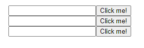

# Pass Values into Angular 2 Components with @Input

**[📹 Video](https://egghead.io/lessons/angular-pass-values-into-angular-2-components-with-@input)**

We can replace the `<li>` elements in **src/app/app.component.ts** from last lesson with `<app-simple-form>` elements from the components we created earlier.

### app.component.ts
```js
...
@Component({
  selector: 'app-root',
  template: 
  `<div>
    <ul>
      <app-simple-form *ngFor="let message of mail.messages">

      </app-simple-form>
    </ul>
  </div>`,
})

...
```
After starting up our development server
```
ng serve
```
We can navigate to localhost:4200 in our browser and see our simple form displayed for each `message` in `messages`



We'll now head over to **src/app/simple-form/simple-form.component.ts** and add an `@Input()`